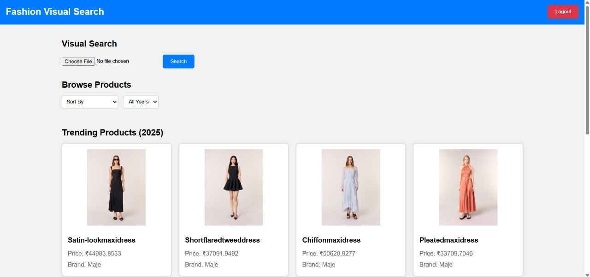

# Fashion Visual Search & Intelligent Styling Assistant

## Overview
The **Fashion Visual Search & Intelligent Styling Assistant** is a web application designed to help users browse, search, and discover fashion products. It leverages visual search technology powered by Pinecone for image-based product matching, provides personalized recommendations using Google Generative AI, and includes features like product browsing, trending items, and user authentication. The project is built with a React frontend, an Express.js backend, and MongoDB for user data storage.

### Features
- **User Authentication**: Sign up and sign in with email and password, secured with JWT.
- **Product Browsing**: Browse fashion products with sorting and filtering options (price, discount, year).
- **Visual Search**: Upload an image to search for similar fashion products using Pinecone for vector similarity.
- **Trending Products**: View trending fashion items for 2025.
- **Personalized Recommendations**: Get product recommendations based on search history, powered by Google Generative AI.
- **Responsive Design**: Optimized for both desktop and mobile devices.

## Tech Stack
- **Frontend**: React, Vite, React Router, Axios
- **Backend**: Express.js, Node.js, MongoDB, Pinecone, Google Generative AI
- **Other Libraries**: Multer (file uploads), JWT (authentication), CSV-parser (data loading)
- **Styling**: Custom CSS

## Prerequisites
Before setting up the project, ensure you have the following installed:
- **Node.js**: v20.11.0 or higher
- **pnpm**: Package manager for the frontend (or npm if preferred)
- **MongoDB**: For user authentication data
- **Pinecone Account**: For visual search (API key required)
- **Google Generative AI API Key**: For personalized recommendations

## Setup Instructions

### 1. Clone the Repository
```bash
git clone https://github.com/your-username/FashionAI.git
cd FashionAI
```

### 2. Backend Setup
1. **Navigate to the Backend Directory**:
   ```bash
   cd backend
   ```

2. **Install Dependencies**:
   ```bash
   npm install
   ```

3. **Set Up Environment Variables**:
   Create a `.env` file in the `backend` directory with the following:
   ```plaintext
   PORT=5000
   MONGO_URI=mongodb://localhost:27017/fashionai
   JWT_SECRET=your_jwt_secret
   PINECONE_API_KEY=your_pinecone_api_key
   PINECONE_INDEX=your_pinecone_index_name
   GOOGLE_API_KEY=your_google_api_key
   ```

4. **Prepare the Product Data**:
   - Place the `jeans_bd_processed_data_fixed.csv` file in `backend/data/`.
   - Ensure images are stored in `backend/images/` (or update paths in the code).

5. **Start MongoDB**:
   ```bash
   mongod
   ```

6. **Start the Backend Server**:
   ```bash
   node server.js
   ```
   - The server will run on `http://localhost:5000`.

### 3. Frontend Setup
1. **Navigate to the Frontend Directory**:
   ```bash
   cd ../frontend
   ```

2. **Install Dependencies**:
   ```bash
   pnpm install
   ```

3. **Set Up Environment Variables**:
   Create a `.env` file in the `frontend` directory with the following:
   ```plaintext
   VITE_API_URL=http://localhost:5000
   ```

4. **Start the Frontend Development Server**:
   ```bash
   pnpm run dev
   ```
   - The app will be accessible at `http://localhost:5173`.

## Usage
1. **Sign Up / Sign In**:
   - Open `http://localhost:5173` in your browser.
   - Navigate to `/auth` to sign up or sign in using an email and password.

2. **Browse Products**:
   - After signing in, you’ll be redirected to the home page (`/home`).
   - Use the "Browse Products" section to view products, with options to sort by price or discount and filter by year.

3. **Visual Search**:
   - In the "Visual Search" section, upload an image of a fashion item.
   - The app will search for similar products using Pinecone’s vector similarity and display results.

4. **Trending Products**:
   - The "Trending Products (2025)" section displays popular items for the year 2025.

5. **Recommendations**:
   - The "Recommended for You" section provides personalized suggestions based on your search history, powered by Google Generative AI.

6. **Logout**:
   - Click the "Logout" button in the header to sign out and return to the auth page.

## File Structure
```
FashionAI/
├── backend/
│   ├── data/
│   │   └── jeans_bd_processed_data_fixed.csv  # Product data
│   ├── images/                                # Product images
│   ├── models/
│   │   ├── Product.js                        # Mongoose model for products
│   │   ├── SearchHistory.js                  # Mongoose model for search history
│   │   └── User.js                           # Mongoose model for users
│   ├── routes/
│   │   ├── auth.js                           # Auth routes (signup, signin)
│   │   ├── products.js                       # Product routes (browse, trending)
│   │   └── search.js                         # Search routes (visual search, recommendations)
│   ├── utils/
│   │   └── loadProducts.js                   # Script to load CSV data into Pinecone
│   ├── .env                                   # Backend environment variables
│   ├── package.json                           # Backend dependencies
│   └── server.js                              # Backend entry point
├── frontend/
│   ├── public/
│   │   └── index.html                        # HTML entry point
│   ├── src/
│   │   ├── components/
│   │   │   ├── Auth.jsx                      # Auth component (signup/signin form)
│   │   │   ├── ProductList.jsx               # Product browsing component
│   │   │   ├── VisualSearch.jsx              # Visual search component
│   │   │   ├── Trending.jsx                  # Trending products component
│   │   │   └── Recommended.jsx               # Personalized recommendations component
│   │   ├── context/
│   │   │   └── AuthContext.jsx               # React context for authentication
│   │   ├── pages/
│   │   │   ├── AuthPage.jsx                  # Auth page
│   │   │   └── Home.jsx                      # Home page
│   │   ├── App.jsx                           # Main React app component
│   │   ├── index.css                         # Global CSS styles
│   │   └── main.jsx                          # Frontend entry point
│   ├── .env                                   # Frontend environment variables
│   ├── package.json                           # Frontend dependencies
│   ├── pnpm-lock.yaml                         # pnpm lock file
│   └── vite.config.js                         # Vite configuration
├── .gitignore                                 # Git ignore file
└── README.md                                  # Project documentation
```

## UI Interface

The frontend is built using React and Vite. The UI interface is divided into several components:

- **Login-Page**:


- **Home-Page**:


## Troubleshooting
- **Backend Fails to Start**:
  - Ensure MongoDB is running (`mongod`).
  - Verify all required dependencies are installed (`npm install` in `backend`).
  - Check `.env` for correct API keys and MongoDB URI.
- **Frontend Fails to Start**:
  - Ensure `pnpm` is installed (`npm install -g pnpm` if not).
  - Verify `package.json` exists and dependencies are installed (`pnpm install`).
  - Check `.env` for the correct `VITE_API_URL`.
- **Visual Search Not Working**:
  - Ensure the Pinecone API key and index name are correct in `backend/.env`.
  - Verify that product data (`jeans_bd_processed_data_fixed.csv`) is loaded into Pinecone.
- **Recommendations Not Working**:
  - Ensure the Google Generative AI API key is correct in `backend/.env`.

## Contributing
1. Fork the repository.
2. Create a new branch (`git checkout -b feature/your-feature`).
3. Make your changes and commit (`git commit -m "Add your feature"`).
4. Push to your branch (`git push origin feature/your-feature`).
5. Create a pull request.

## License
This project is licensed under the MIT License.

